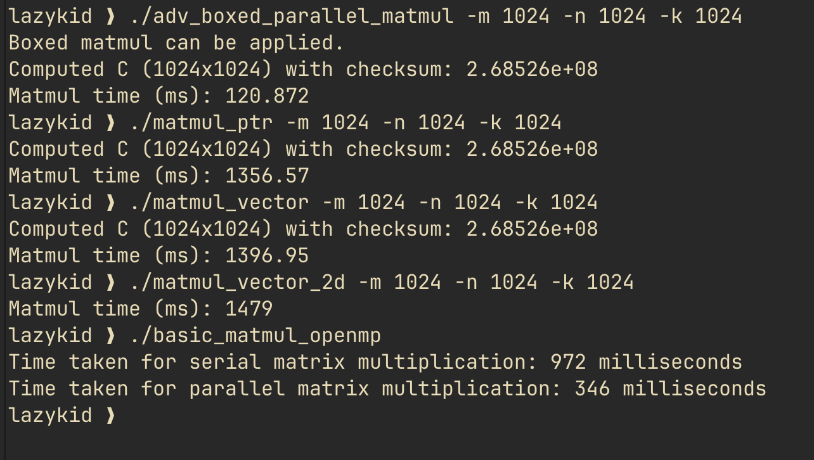

# C++ Matrix Multiplication 

In this project we implement matrix multiplication in cpp and then optimize it get best results on cpu.

- The best implementation right now is adv_boxed_parallel_matmul.cpp which uses both boxed matrix multiplication and parallelization using openmp. 
- **the least time it takes to mutliply matrix A and matrix B both with `1024x1024` dimensions and type `double` is ~120 ms.**
- for blocked parallele matrix multiplication we found that using number of blocks NB = 128 gives us the most optimal soluction which is ~120ms for our specific dimensions of matrix.

## Results



## Build

### Using Make

```bash
make
```

## Run

```bash
./matmul_vector -m 1024 -n 1024 -k 1024
```

## Third-Party

The AnyOption sources are vendored into the repository at:

```
third_party/anyoption/
```

They are committed to the repo so the project can be built without external dependencies.
