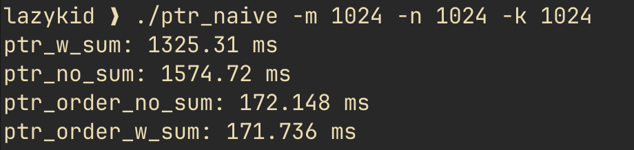

# logs

### date: 20/04/2026

- figured out best values for TM = 32, TN = 128, TK = 16 using autotune.py
- applied custom tiling 

### date: 18/04/2026

- mislogged / misinterpreted changes in last log entry. 
- the performance gain had nothing to do with sum variable in ptr implementation in matmul_ptr.cpp. 
- the actual gain from 1560ms to 190ms happend because of loop ordering.
- loop ordering is where we calculate the entire row of C matrix in third loop instead of calculating single element.
- this [commit](https://github.com/itsvineet99/cpp_matmul/commit/88d71da2af8babf92237e652ca50a17498682a28) is where i have changed implementation
- and yes in vector implementation removing this variable backfires cause of threads needing to access the variable from main memory, when we do have local variable each thread gets its own variable so they update value in that variable so it improves performance.

- the new file ptr_naive.cpp confirms that when we use loop ordering, the existance of sum variable doesn't matter much. for matrix 1024x1024 dimension having sum variable in loop ordered implementation only gives 0.41 ms of improvement
- but for not optimized by loop ordering implementation gets some benefits from having sum variable like ~250 ms of performance gain.
- results:

### date: 15/04/2026

- using sum variable to store the matmul cause loss of performane in pointer implementation. rather if we directly add values in C matrix then it gives massive performance gain like from 1560ms to 190ms.
- but the same thing backfires on vector implementation and loses perfomance.
- gigaflops formula: 

$$
\text{GigaFLOPS} = \frac{2 \times M \times N \times K}{\text{Time in Seconds} \times 10^9}
$$

### date: 14/04/2026

- was using -O2 flag for adv_boxed_parallel_matmul.cpp while using -O0 for all other implementations. this was probably a mistake cause then compiler added some more optimization which i don't know nothing about and it also was unfair comparison between implementation that is not optimized by compiler vs implementation that is optimized by compiler.
- boxed matmul is good it only gives like 400ms of performance gain for 1024 dimension matrix while comparing it with naive matmul with pointer version to store matrix.
- the real gain happens when we use openmp to parallelize our matmul i.e each block is handled by different thread. this gives us like 3400ms of performance gain when comparing with naive matmul with pointer version to store matrix.
